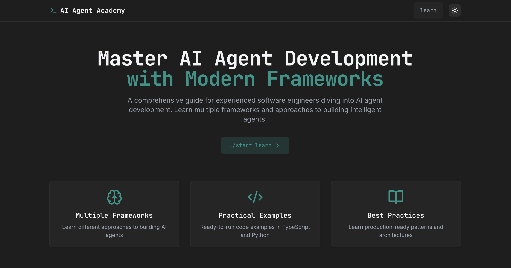
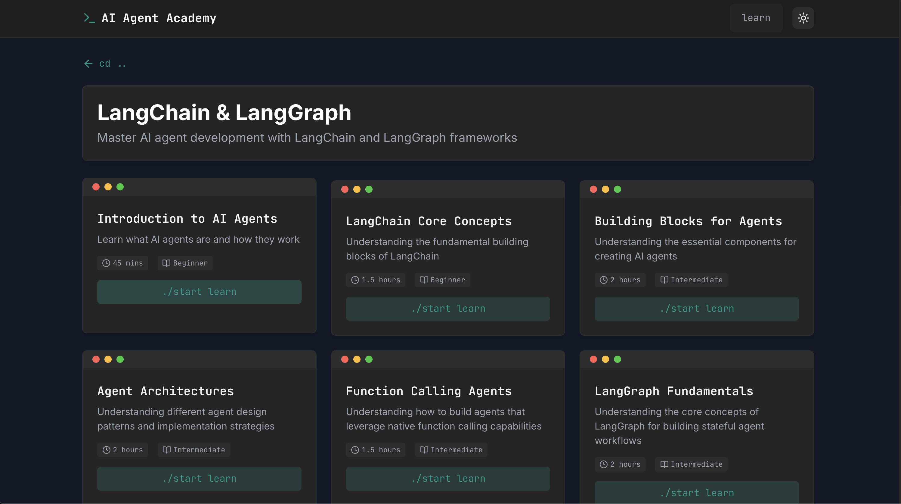
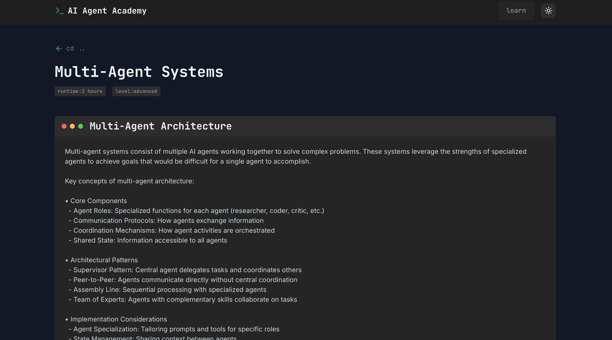
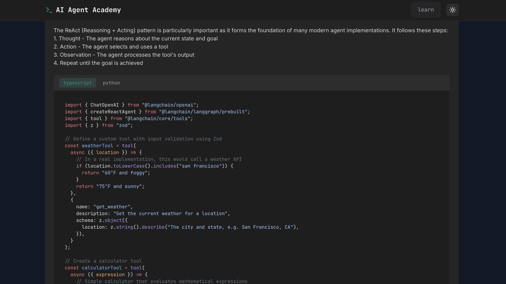

# AI Agents Academy

A quick project created to introduce myself to AI agent frameworks like LangChain and Google ADK. The site was built using Bolt for the UI and Augment + FireCrawl for refinement and course content.

## Screenshots

### Landing Page

### Courses Overview

### Course Content

### Python + TS/Node Code Snippets

